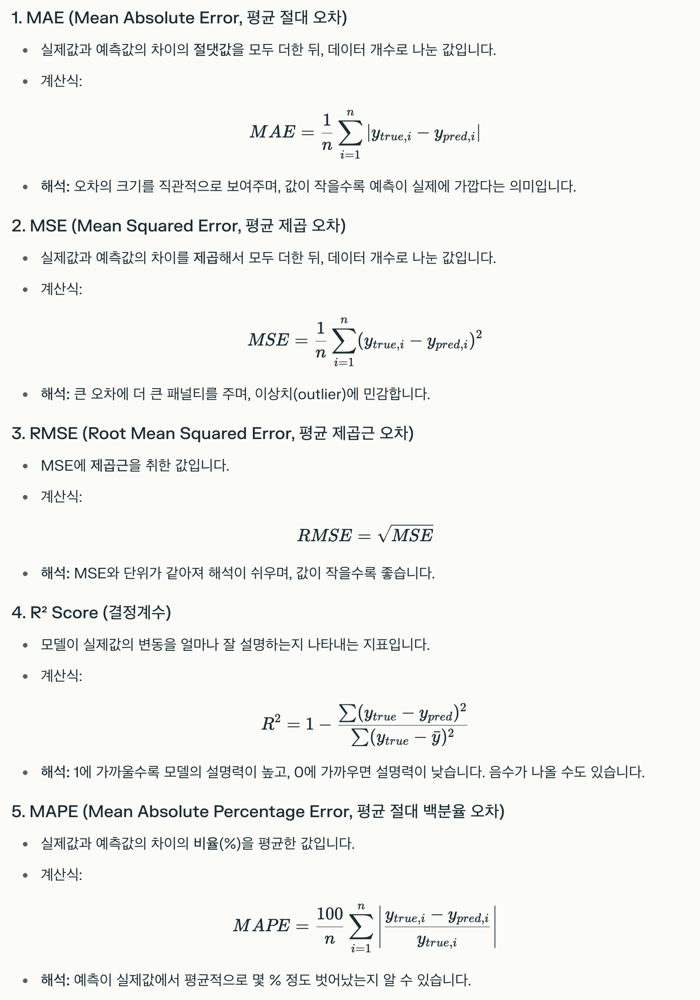
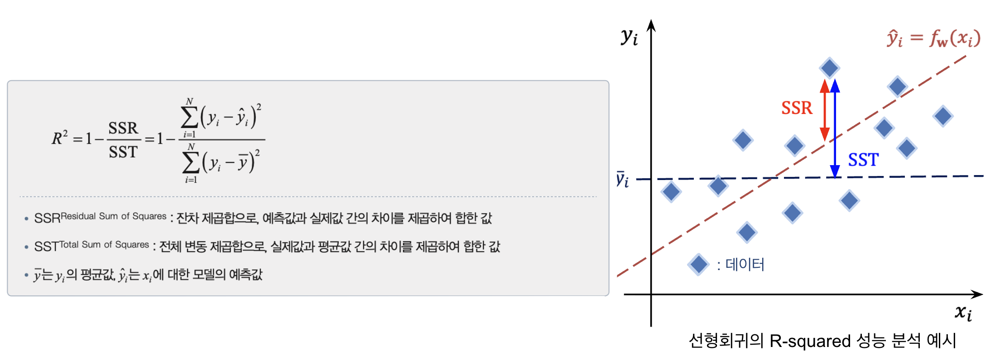
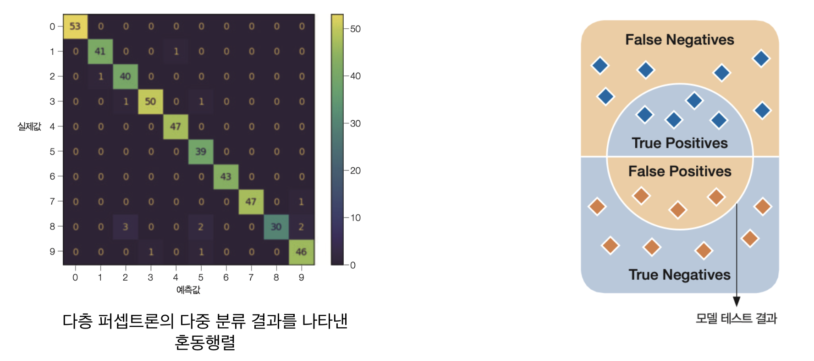
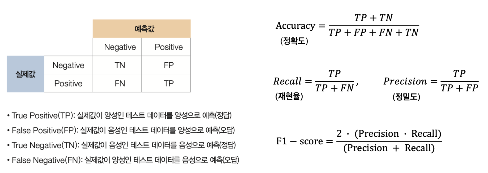
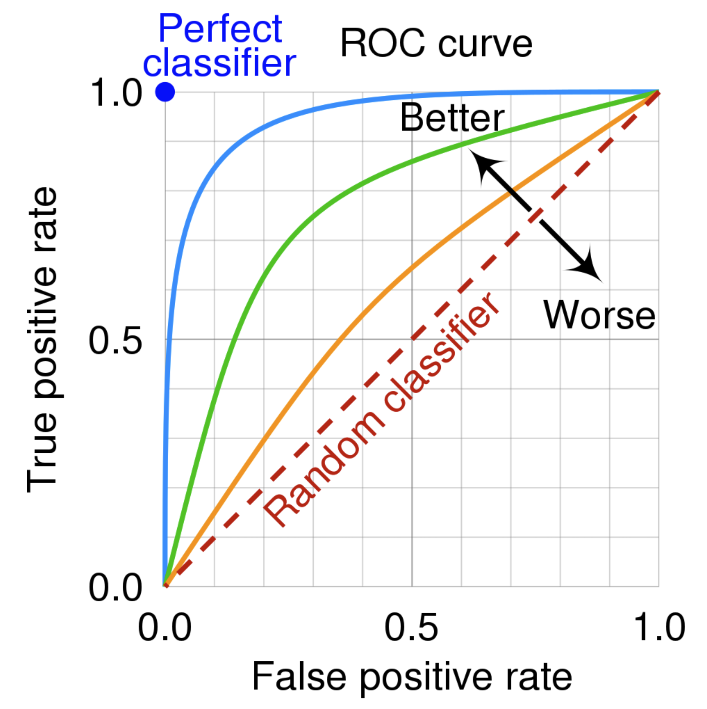
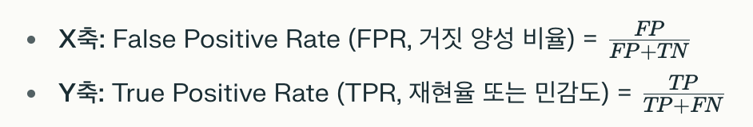

## **Evaluation Metrics**

<hr style="border: none; height: 1px; background-color: #e0e0e0; margin: 16px 0;" />
모델의 목적에 따라 다양한 성능 평가 지표를 활용

## 회귀(Regression)

<hr style="border: none; height: 1px; background-color: #e0e0e0; margin: 16px 0;" />

- 실제값과 예측값의 차이를 수치로 나타내는 다양한 지표를 사용

- 결정계수(Coefficient of Determination or R-squared Score)를 주로 사용

    - 1에 가까울수록 모델의 설명력이 높고, 0에 가까우면 설명력이 낮음. 음수가 나올 수 있음


- MAE, MSE, RMSE, MAPE는 값이 **작을수록** 모델의 예측이 실제에 가깝다는 의미

## 분류(Classification)

<hr style="border: none; height: 1px; background-color: #e0e0e0; margin: 16px 0;" />
- 혼동 행렬(Confusion Matrix)을 기반으로 여러 지표를 산출

- 모델이 예측한 값과 실제 값을 비교해, 얼마나 정확히 분류했는지 어떤 오류가 발생했는지 보여줌

- 혼동 행렬(Confusion Matrix) 구성

    - **TP (True Positive)**: 실제 Positive를 Positive로 맞게 예측

    - **TN (True Negative)**: 실제 Negative를 Negative로 맞게 예측

    - **FP (False Positive)**: 실제 Negative를 Positive로 잘못 예측 (오류)

    - **FN (False Negative)**: 실제 Positive를 Negative로 잘못 예측 (오류)



- 주요 평가 지표

    - Accuracy (정확도) : 전체 데이터 중 맞게 예측한 비율

        - 클래스 불균형 데이터에서는 신뢰도가 떨어질 수 있음

    - Precision (정밀도) : 모델이 Positive로 예측한 것 중 실제 Positive 비율

        - False Positive를 얼마나 줄였는지 평가

    - Recall (재현율, 민감도) : 실제 Positive 중 모델이 맞게 예측한 비율

        - False Negative를 얼마나 줄였는지 평가

    - F1 Score : Precision과 Recall의 조화 평균

        - 불균형 데이터에서 모델 성능을 종합적으로 평가할 때 유용

    - ROC Curve / AUC

        - ROC Curve : 이진 분류 모델의 성능을 평가하는 그래프로, 다양한 임계값(threshold)에서의 모델 성능 변화를 시각화함

        - AUC (Area Under the Curve) : ROC Curve 아래 면적을 의미

            - 값은 0과 1 사이이며, 1에 가까울수록 완벽한 분류기, 0.5는 무작위 추측 수준을 나타냄

            - 곡선 아래 면적이 클수록 좋은 모델



## MLP의 성능 향상을 위한 고려사항

<hr style="border: none; height: 1px; background-color: #e0e0e0; margin: 16px 0;" />
### (1) 하이퍼파라미터 튜닝

#### 하이퍼파라미터

- 모델의 구조와 학습 방식을 결정하는 사용자가 직접 설정하는 값

- 하이퍼파라미터는 모델의 성능에 큰 영향을 주므로, 여러 값을 실험하며 최적의 조합을 찾는 과정(튜닝)이 필요함

#### 하이퍼파라미터 종류

1. **Epoch(에포크)**

    - 전체 데이터셋을 모델이 몇 번 반복해서 학습할지 정하는 횟수

    - 너무 적으면 과소적합, 너무 많으면 과적합 위험이 있음

    - 대부분의 경우 훈련 반복 횟수는 튜닝할 필요가 없음. 대신 조기 종료를 사용

1. **Batch Size(배치 크기)**

    - 한 번에 학습에 사용하는 데이터 샘플의 개수

    - GPU RAM에 맞는 가장 큰 배치 크기 사용이 권장

    - 크기가 크면 학습 속도는 빨라지지만, 메모리 사용량이 늘고 일반화가 어려울 수 있음. 작으면 학습이 느려지지만 일반화에 도움이 될 수 있음

1. **Learning Rate(학습률)**

    - 가중치가 얼마나 빠르게(또는 천천히) 업데이트되는지 결정하는 값

    - 너무 크면 학습이 불안정해지고, 너무 작으면 학습이 느려짐

1. **Number of Layers(계층의 수)와 각 층의 뉴런 수**

    - 은닉층(hidden layer)과 각 층의 뉴런 개수는 모델의 복잡도 결정

    - 층이 많고 뉴런이 많을수록 복잡한 패턴을 학습할 수 있지만, 과적합 위험도 커짐

1. **Optimizer(최적화 알고리즘)**

    - 고전적인 평범한 미니배치 경사 하강법보다 더 좋은 옵티마이저를 선택하는 것(그리고 이 옵티마이저의 하이퍼파라미터를 튜닝하는 것)도 매우 중요

    - 가중치 업데이트 방식을 결정 (예: SGD, Adam 등)

1. **Activation Function(활성화 함수)**

    - 각 뉴런의 출력을 결정하는 함수로, 비선형성 부여 (예: ReLU, Sigmoid, Tanh 등)

    - 일반적으로 ReLU 활성화 함수가 모든 은닉 층에 좋은 기본값

    - 출력 층의 활성화 함수는 수행하는 작업에 따라 달라짐

1. **Regularization(규제) 관련 파라미터**

    - 과적합을 방지하기 위한 드롭아웃 비율, L1/L2 패널티 등도 하이퍼파라미터에 포함

### (2) **은닉 층 개수**

- 복잡한 문제에서는 심층 신경망이 얕은 신경망보다 파라미터 효율성(parameter efficiency)이 훨씬 좋음

    - 실제 데이터는 계층 구조를 가진 경우가 많으므로 심층 신경망은 이런 면에서 유리

        - 아래쪽 은닉 층은 저수준의 구조를 모델링(여러 방향이나 모양의 선)

        - 중간 은닉 층은 저수준의 구조를 연결해 중간 수준의 구조를 모델링(사각형, 원)

        - 가장 위쪽 은닉 층과 출력 층은 중간 수준의 구조를 연결해 고수준의 구조를 모델링(얼굴)

    - 계층 구조는 심층 신경망이 좋은 솔루션으로 빨리 수렴하게 도와줄 뿐만 아니라 새로운 데이터에 일반화되는 능력도 향상

### (3) **은닉 층의 뉴런 개수**

- 입력 층과 출력 층의 뉴런 개수는 해당 작업에 필요한 입력과 출력의 형태에 따라 결정

    - 예를 들어 MNIST는 28×28 = 784개의 입력 뉴런과 10개의 출력 뉴런이 필요

- 은닉 층의 구성 방식은 일반적으로 각 층의 뉴런을 점점 줄여서 깔때기처럼 구성

    - 저수준의 많은 특성이 고수준의 적은 특성으로 합쳐질 수 있기 때문임

- 층의 개수와 마찬가지로 네트워크가 과대적합이 시작되기 전까지 점진적으로 뉴런 수를 늘릴 수 있음

    - 필요한 것보다 더 많은 층과 뉴런을 가진 모델을 선택한 다음, 과대적합되지 않도록 조기 종료나 규제 기법을 사용


```toc
```