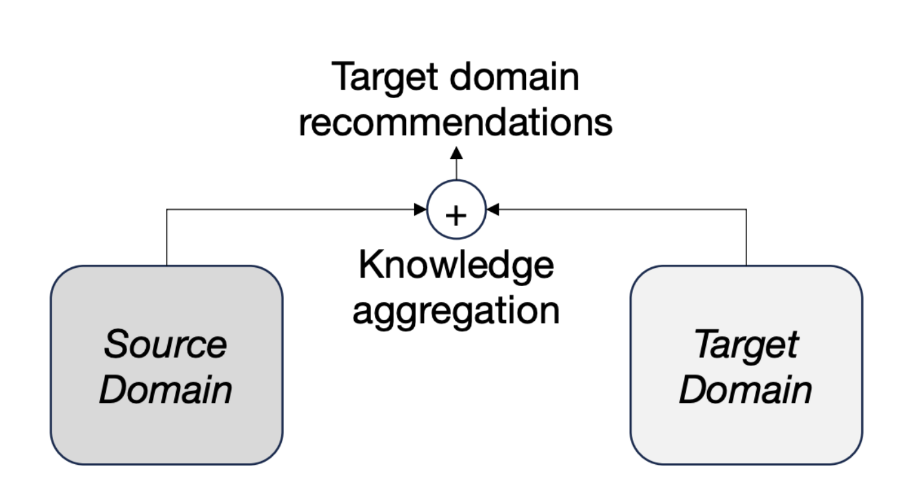
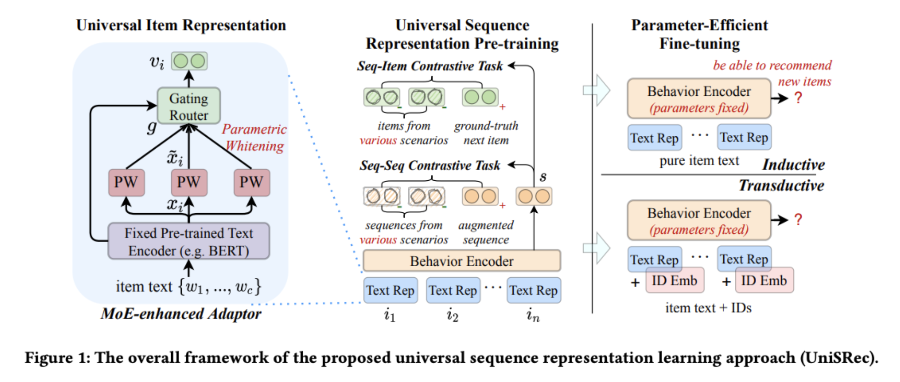
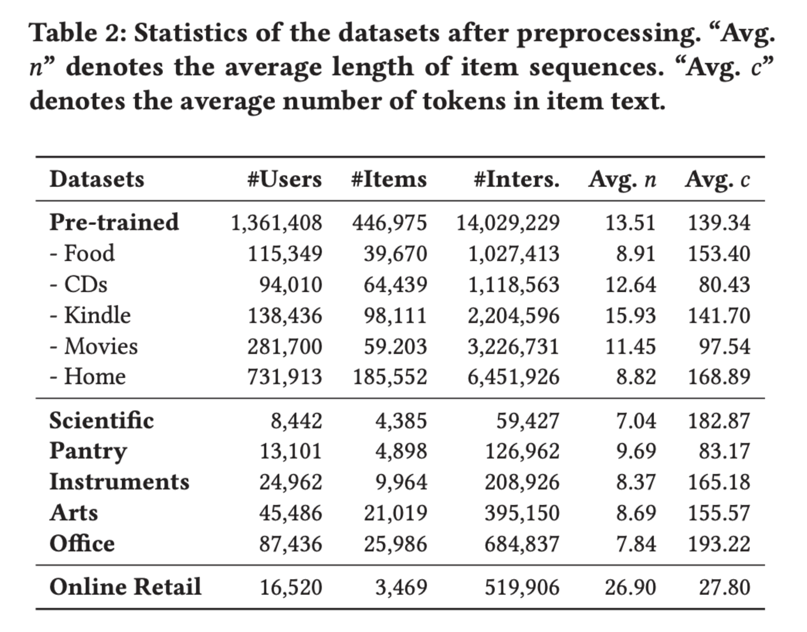
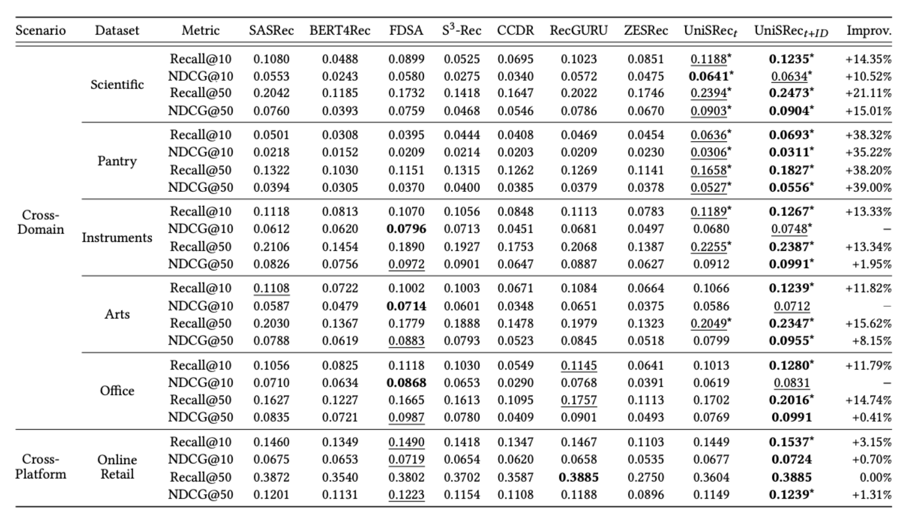
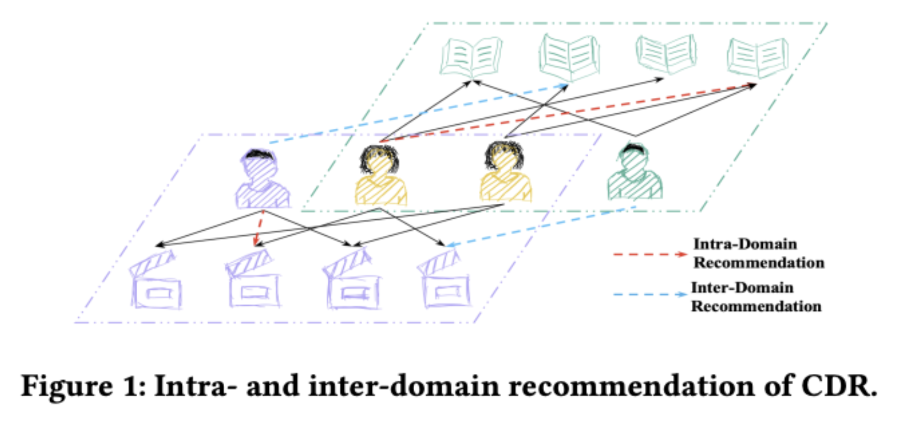
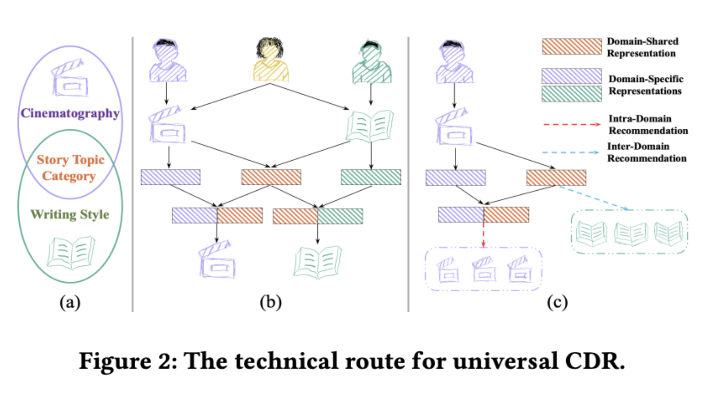
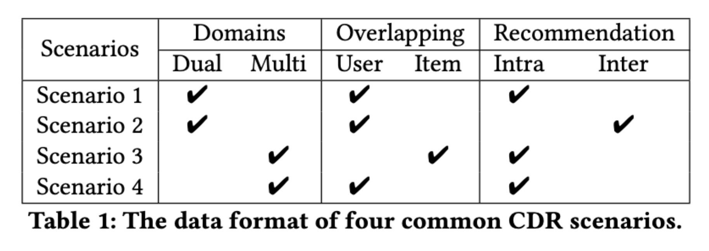
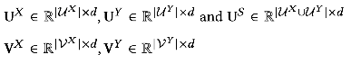
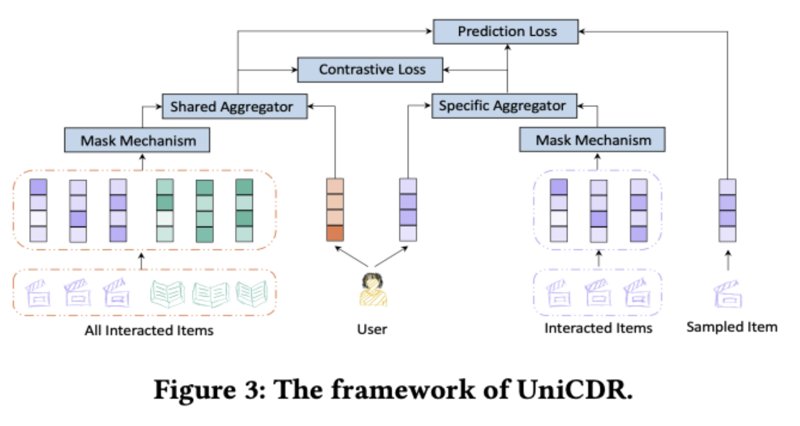
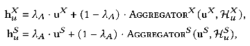

## Abstract

본 문서는 Multi-Domain Recommendation(MDR) 문제 해결을 위해 기존 Cross-Domain Recommendation(CDR) 관련 연구들과 최신의 MDR 연구를 살펴보고 현업에 적용하기 위한 연구 방향을 제안합니다. 최근 연구된 UniSRec, UniCDR, MDRAU 세 개의 모델을 살펴보면서 MDR 연구의 큰 흐름을 이해합니다. 최근의 연구들은 사용자 행동 기준으로 도메인을 seen과 unseen을 기준으로 source domain과 target domain으로 구분하며, Sequence 기반의 user, item 데이터를 고전적인 방식의 id 기반이 아닌 text representation를 사용해서 더 많은 정보를 사용합니다. 모델링의 경우 더 긴 text를 인코딩하기 위한 개선된 transformer를 사용하고 contrastive model과 transfer model을 채택합니다. 대조학습의 성능 개선을 위한 masking mechanism과 여러 embedding을 합치기 위해 다양한 Aggregator 방식을 제안하여 추천 성능을 향상시키고 있습니다. 이러한 분석을 바탕으로 어떻게 현업에 적용할지 실험 방법을 정의하고 구체적인 구현 방법을 제시합니다.

### Multi-Domain Recommendation

최근 웹플랫폼에서는 다양한 서비스 도메인을 동시에 운영하면서 특정 도메인을 사용하는 사용자에게 다른 도메인의 상품을 어떻게 추천할지에 대한 연구가 활발하게 진행되고 있으며 결국 사용자의 경험을 개선하여 서비스의 품질을 향상시킵니다.

Cross-Domain Recommendation(CDR)의 목표는 다양한 정보를 활용하여 추천 품질을 향상시키는 것을 목표로 합니다. 이는 데이터 희소성 문제를 완화할 수 있는 유망한 접근 방식 중 하나입니다. 특히, 일반적으로 3개 이상의 도메인을 처리하는 경우 MDR(Multi-Domain Recommendation)이라고 하며 CDR의 하위 범주입니다.


CDR 관련 2건의 연구와 최근 MDR 관련 연구 1건을 살펴보겠습니다.

- [Towards Universal Sequence Representation Learning for Recommender Systems, Alibaba, KDD 2022](https://dl.acm.org/doi/10.1145/3534678.3539381)

- [Towards Universal Cross-Domain Recommendation, WSDM’23](https://dl.acm.org/doi/abs/10.1145/3539597.3570366)

- [Multi-Domain Recommendation to Attract Users via Domain Preference Modeling, AAAI 2024](https://arxiv.org/abs/2403.17374)

## Related Research

### Towards Universal Sequence Representation Learning for Recommender Systems, Alibaba, KDD 2022

- 논문 : [https://dl.acm.org/doi/10.1145/3534678.3539381](https://dl.acm.org/doi/10.1145/3534678.3539381)

- 코드 : [https://github.com/RUCAIBox/UniSRec](https://github.com/RUCAIBox/UniSRec)

#### Motivation

- 기존 sequence representation learning (SRL) 방법은 item ID에 의존하지만 item ID를 명시적으로 모델링하는 한계를 해결하기 위해 UniSRec이라는 새로운 universal sequence representation learning 방식을 제시합니다.

- 제안된 접근 방식은 item의 관련 설명 텍스트를 활용하여 다양한 추천 시나리오에서 transferable representations을 학습합니다.

- pre-trained universal sequence representations model을 사용하면 새로운 추천 도메인이나 플랫폼으로 효과적으로 transfer될 수 있습니다.

#### UniSRec

- item ID는 우리 접근 방식의 보조 정보일 뿐이며 주로 항목 텍스트를 활용하여 일반화 가능한 ID 독립적 표현을 도출합니다.

- universal item representations을 학습하기 위해 우리는 parametric whitening을 기반으로 하는 MoE enhanced 어댑터를 사용한 도메인 융합 및 적응에 중점을 둡니다.

- universal sequence representations을 학습하기 위해 multi-domain negatives를 샘플링하여 sequence-item과 sequence-sequence contrastive tasks 두 가지 종류의 대조 학습 작업을 소개합니다.


#### Universal Textual Item Representation

- Textual Item Encoding via Pre-trained Language Model

자연어 형태로 item 특성을 텍스트 기반으로 전송 가능한 항목 표현을 학습하는 것입니다. 사전 훈련된 언어 모델(PLM)을 활용하여 텍스트 임베딩을 학습합니다.

- Semantic Transformation via Parametric Whitening

BERT에서 의미론적 표현을 얻을 수 있지만 추천 작업에는 직접적으로 적합하지 않습니다. 서로 다른 도메인에서 파생된 텍스트 의미를 보편적인 의미로 변환하기 위해 Parametric Whitening 및 MoE-enhanced Adaptor 기술을 제안합니다.

- Domain Fusion and Adaptation via MoE-enhanced Adaptor

whitening embeddings을 학습하고 이러한 임베딩의 적응형 조합을 universal item representations으로 활용하며 유연한 표현 메커니즘을 구축하는 것을 목표로 합니다.

- MoE-enhanced Adaptor의 장점은 첫째, 여러 whitening transformation을 학습함으로써 단일 item의 표현력이 향상됩니다. 둘째, 학습 가능한 gating mechanism을 활용하여 도메인 융합 및 적응을 위한 의미론적 관련성을 적응적으로 설정합니다. 셋째, lightweight adaptor는 새로운 도메인에 적응할 때 매개변수 효율적인 미세 조정의 유연성을 제공합니다.

#### Universal Sequence Representation

Item representation을 도출할 때 다양한 영역의 융합과 적응을 더욱 향상시키기 위해 기본 동작 인코더 아키텍처와 보편적 의미 공간에서 시퀀스 표현을 향상시키는 제안된 대조 사전 학습 작업을 제시합니다.

- Self-attentive Sequence Encoding

universal item representation의 시퀀스가 주어지면 사용자 행동 인코더를 추가로 활용하여 시퀀스 표현을 얻습니다. 널리 사용되는 self-attentive 아키텍처, 즉 Transformers를 채택합니다.

- Multi-domain Sequential Representation Pre-training

통합 representation 공간에서 sequential encoder의 출력을 도출하기 위해 적합한 최적화 목표를 설계하는 방법을 연구합니다.

- Sequence-item contrastive task

Sequence-item contrastive task는 순차 컨텍스트(즉, 관찰된 하위 시퀀스)와 상호 작용 시퀀스의 잠재적인 다음 항목 간의 본질적인 상관 관계를 포착하는 것을 목표로 합니다. 주어진 시퀀스에 대해 도메인 간 항목을 부정으로 채택합니다. 이러한 방법은 도메인 전반에 걸쳐 의미론적 융합과 적응을 모두 향상시킬 수 있으며, 이는 보편적인 시퀀스 표현을 학습하는 데 도움이 됩니다.

- Sequence-sequence contrastive task

다중 도메인 상호 작용 시퀀스 간의 대조 학습을 수행하여 시퀀스 수준 사전 학습 작업을 제안하며 두 가지 종류의 증강 전략을 고려합니다. (1) Item drop은 원래 순서에서 고정된 비율의 항목을 무작위로 드롭하는 것을 의미하고, (2) Word drop은 항목 텍스트에서 단어를 무작위로 드롭하는 것을 의미합니다.

#### Experiments

#### Datasets

1) Pre-trained datasets : Amazon review dataset, “Grocery and Gourmet Food”, “Home and Kitchen”, “CDs and Vinyl”, “Kindle Store”, “Movies and TV”에서 5개 카테고리를 선택합니다. 사전 학습을 위한 소스 도메인 데이터세트로 사용됩니다

2) Cross-domain datasets : Amazon review dataset에서 “Prime Pantry”, “Industrial and Scientific”, “Musical Instruments”, “Arts, Crafts and Sewing” 및 “Office Products”의 또 다른 5개 카테고리를 선택합니다. 교차 도메인 설정에서 제안된 접근 방식을 평가하기 위한 대상 도메인 데이터 세트로 사용됩니다.

3) Cross-platform datasets : 교차 플랫폼 설정에서 사전 훈련된 범용 시퀀스 표현 모델을 평가하기 위해 다양한 플랫폼(Online Retail)에서 데이터 세트를 선택합니다. Amazon 플랫폼과 공유된 사용자 또는 항목은 포함되지 않습니다.


#### Overall Performance

- 제안된 접근 방식을 5개의 크로스 도메인 데이터 세트와 1개의 크로스 플랫폼 데이터 세트에 대한 기본 방법과 비교합니다.

- 접근 방식을 위해 이러한 6개 데이터 세트에 대해 동일한 사전 훈련된 범용 시퀀스 표현 모델을 미세 조정합니다.

- text-enhanced sequential recommendation(예: FDSA 및 S3 -Rec)이 여러 데이터 세트에서 traditional sequential recommendation(예: SASRec 및 BERT4Rec)보다 더 나은 성능을 발휘합니다.

- 제안된 접근 방식 UniSRec𝑡+𝐼𝐷을 모든 기준과 비교함으로써 UniSRec𝑡+𝐼𝐷이 거의 모든 경우에서 최고의 성능을 보입니다.

- 특히, 크로스 플랫폼 평가(Online Retail)에 대한 결과는 우리의 접근 방식이 universal sequence representations 사전 학습을 통해 다른 플랫폼으로 효과적으로 이전될 수 있음을 보여줍니다.


#### Conclusions

- UniSRec이라는 추천 시스템을 위한 universal sequence representation 학습 접근 방식을 제안합니다.

- UniSRec은 순차 추천을 위해 item 텍스트를 활용하여 더 많은 전달 가능한 표현을 학습합니다.

- universal item representations 표현을 학습하기 위해 parametric whitening 및 MoE-enhanced adaptor를 기반으로 하는 lightweight architecture를 설계합니다.

- 우리는 multi-domain sequences로부터 universal sequence representations을 학습하기 위해 두 가지 contrastive pre-training tasks를 추가로 설계합니다.

### Towards Universal Cross-Domain Recommendation, WSDM’23

- 논문 : [https://dl.acm.org/doi/abs/10.1145/3539597.3570366](https://dl.acm.org/doi/abs/10.1145/3539597.3570366)

- 코드 : [https://github.com/cjx96/UniCDR](https://github.com/cjx96/UniCDR)

#### Motivation

- 새로운 도메인에서 추천을 제공할 때, 도메인 별로 사용자의 행동 패턴이 다르기도 하도 충분한 interaction 정보 (클릭, 장바구니, 구매 등)가 없기 때문에 기존 도메인에서 잘 동작하던 추천 모델을 그대로 적용하면 만족스런 추천을 제공하기 어렵습니다.

- CDR은 신규 도메인 또는 비주류 도메인 상품을 사용자에게 추천할 때 부족한 interaction정보를 보완하기 위해 인기가 많은 도메인에서 발생한 interaction 정보를 활용합니다.

#### UniCDR

#### Definitions

- source domain : 인기있는 기존 도메인

- target domain : 비주류 신규 도메인

- intra-domain recommendation: target domain을 사용하고 있는 사용자에게, source domain의 interaction을 활용해서 더 정확한 추천을 제공하는 방법입니다.

- inter-domain recommendation: target domain을 사용한 적 없는 사용자에게, source domain의 interaction을 활용해서 더 정확한 추천을 제공하는 방법입니다.


- 두 접근법 모두 source domain의 interaction을 활용한다는 공통점이 있지만, 추천 대상 사용자가 양쪽 도메인을 모두 경험했는지 여부에 따라 달라집니다.

- 실제 서비스에서 새로운 도메인 서비스를 시작한다면 두 접근법이 다루는 상황이 동시에 발생하기 때문에 이를 함께 다루 수 있는 모델이 필요합니다.

- domain-specific representation : 사용자와 상품에 대해서 한 도메인만 가진 정보

- domain-shared representation : 여러 도메인에서 공통으로 발견되는 정보

- domain-specific representation과 domain-shared representation을 학습하는 모델인 UniCDR을 제안합니다.

- UniCDR을 활용하면 intra-domain recommendation에서는 domain-specific representation과 domain-shared representation을 함께 사용하고, inter-domain recommendation에서는 domain-shared representation만 사용해서 두 상황에 모두 대응할 수 있습니다.


#### CDR scenarios

CDR이 적용될 수 있는 4가지 시나리오를 가정하고, 각 시나리오에 대해서 실험을 진행합니다.

- Dual vs. Multi : 도메인이 2개인지 3개 이상 인지

- user vs. item overlapping : 사용자 또는 상품이 여러 도메인에 중복해서 있는지

- Intra vs. Inter : target domain에서의 interaction이 있는지 없는지

아래 모델 설명 부터는 시나리오 1, 2 번을 기준으로 진행합니다.


#### Embedding Layer

UniCDR에서 사용자와 상품은 도메인별 임베딩 뿐만 아니라 도메인과 무관한 임베딩을 갖습니다. 예를 들어 시나리오 1번 에서 사용자는 3개의 임베딩 (source domain embedding, target domain embedding, shared embedding)을 갖고, 상품은 2개의 임베딩 (source or target domain embedding, shared embedding) 을 갖습니다. 수식으로 표현하면 아래와 같습니다. (U = 사용자, V = 상품)



#### Aggregator Architecture

Aggregator는 사용자의 history (interaction sequence)에 있는 item들의 embedding을 하나의 embedding으로 변환하며 3개의 aggregator를 제안합니다.

1) Mean-pooling aggregator : embedding 평균을 계산한 뒤 linear projection 하는 가장 간단한 방법입니다.

2) User-attention-pooling aggregator : history의 각 상품과 사용자 embedding과의 attention score를 계산하여 이를 반영한 weighted sum한 뒤 linear projection합니다. 상대적으로 중요한 상품을 더 많이 고려할 수 있습니다.

3) Item-similarity-pooling aggregator : EASE^R 모델을 사용해서 item-item similarity matrix를 구한 뒤, 이를 user-item interaction matrix와 행렬곱하여 사용자 row의 각 상품 column값을 weight로 사용하여 weighted sum한 뒤 linear projection 합니다.

#### Domain-specific & domain-shared representation

위에서 소개한 embedding layer와 Aggregator를 거치면, 도메인 별(X, Y) 그리고 공용 (S) representation 을 구할 수 있습니다. (H는 user history).


이때, H^X는 사용자의 history중 X도메인에서만 발생한 상품과의 interaction만 의미하고, H^S는 모든 도메인에서 발생한 interaction을 의미합니다.

#### Masking Mechanism and Contrastive Loss


```toc
```