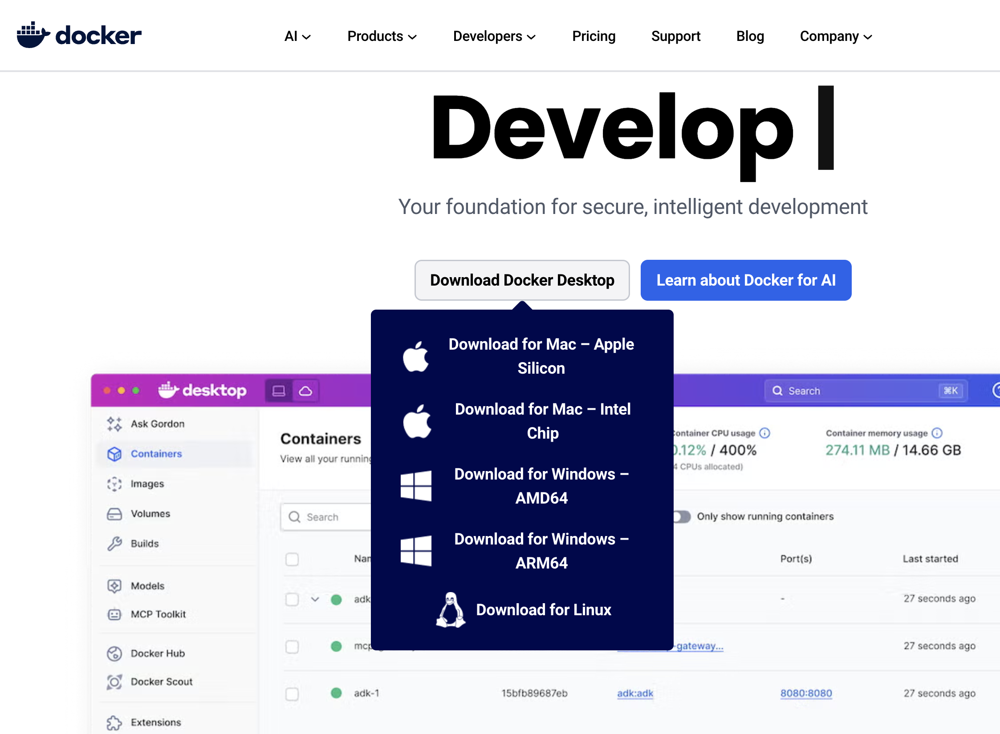

## Docker란?

<hr style="border: none; height: 1px; background-color: #e0e0e0; margin: 16px 0;" />
- Docker는 Docker Inc.에서 개발한 무료 소프트웨어로, 애플리케이션을 독립적이고 격리된 환경에서 실행할 수 있게함

- 이 환경들은 컨테이너(Container)라고 불리며, 컨테이너를 이용하면 개발자가 애플리케이션을 어떤 기기에서도 실행할 수 있음

- Docker는 2013년 3월 13일에 처음 공개되었으며, 이후 IT 개발 세계에서 필수적인 도구로 자리 잡았음

## Docker의 주요 기능

<hr style="border: none; height: 1px; background-color: #e0e0e0; margin: 16px 0;" />
- **격리된 운영 환경 제공**: 컨테이너는 격리된 환경을 제공하여 애플리케이션이 다른 시스템 자원과 충돌하지 않도록 함

- **빠른 시작 및 종료**: 애플리케이션을 몇 초 만에 시작하고 종료할 수 있음

- **다중 플랫폼 지원**: Docker 컨테이너는 어떤 시스템에서도 실행될 수 있음

- **손쉬운 배포 및 스케일링**: Docker 이미지를 이용하면 손쉽게 애플리케이션을 배포하고 확장할 수 있음

## Docker 설치 방법

<hr style="border: none; height: 1px; background-color: #e0e0e0; margin: 16px 0;" />
공식사이트를 방문하여 운영체제에 맞는 도커 설치

- [https://www.docker.com/](https://www.docker.com/)


## Docker로 python 파일 실행하기

<hr style="border: none; height: 1px; background-color: #e0e0e0; margin: 16px 0;" />
### 프로젝트 생성

프로젝트 폴더를 만들고, 다음 두 파일을 생성합니다:

1. `main.py`: 실행할 Python 코드가 들어있는 파일

1. `Dockerfile`: Docker 이미지를 빌드하는 데 필요한 설정 파일

디렉토리 구조는 다음과 같습니다:

```plain text
.
├── Dockerfile
└── main.py
```

### Python 파일 작성

`main.py` 파일에 다음 코드를 추가합니다:

```python
#!/usr/bin/env python3
print("Hi, LG DX SCHOOL!")
```

### Dockerfile 작성

`Dockerfile` 파일에 다음 내용 추가

```plain text
# 베이스 이미지로 Python 사용
FROM python:latest

# Python 파일을 컨테이너로 복사
COPY main.py /

# 컨테이너 실행 시 Python 파일 실행
CMD [ "python", "./main.py" ]
```

### Docker 이미지 빌드

```bash
docker build -t python-test .
```

### Docker 이미지 실행

```bash
docker run python-test
```

출력 결과

```plain text
Hi, LG DX SCHOOL!
```

## Docker 이미지 및 컨테이너 관리

<hr style="border: none; height: 1px; background-color: #e0e0e0; margin: 16px 0;" />
### 이미지 목록 확인

```bash
docker image ls
```

### **이미지 삭제**

```bash
docker image rm [이미지 이름]
```

### 컨테이너 목록 확인

현재 실행 중인 모든 컨테이너를 확인

```bash
docker ps
```

### 모든 컨테이너 목록 확인

실행 중이지 않은 모든 컨테이너를 포함하여 확

```bash
docker ps -a
```

### 컨테이너 중지

```bash
docker stop [컨테이너 이름]
```

### 컨테이너 삭제

중지된 경우에만 삭제 가능함

```bash
docker rm [컨테이너 이름]
```

### 컨테이너 로그 확인

```bash
docker logs [컨테이너 이름]
```

## Docker Compose

<hr style="border: none; height: 1px; background-color: #e0e0e0; margin: 16px 0;" />
- Docker Compose는 다수의 컨테이너를 쉽게 관리할 수 있게 해주는 도구

- 여러 컨테이너를 YAML 파일로 정의하고, 한 번에 시작할 수 있음

### wordpress + mysql 생성 Docker Compose 파일 작성

```yaml
services:
  mysql:
    image: mysql:8.0
    volumes:
      - mysql-data:/var/lib/mysql
    environment:
      MYSQL_RANDOM_ROOT_PASSWORD: true
      MYSQL_DATABASE: wordpress
      MYSQL_USER: wordpress
      MYSQL_PASSWORD: awesome-wordpress-password

  wordpress:
    depends_on:
      - mysql
    image: wordpress:latest
    ports:
      - "3000:80"
    environment:
      WORDPRESS_DB_HOST: mysql:3306
      WORDPRESS_DB_USER: wordpress
      WORDPRESS_DB_PASSWORD: awesome-wordpress-password

volumes:
  mysql-data:
```

### Docker Compose 실행

```bash
docker-compose up
```

### Docker Compose 중지

```bash
docker-compose down
```

## 예제

<hr style="border: none; height: 1px; background-color: #e0e0e0; margin: 16px 0;" />
- [https://github.com/cserock/docker-example](https://github.com/cserock/docker-example)


```toc
```