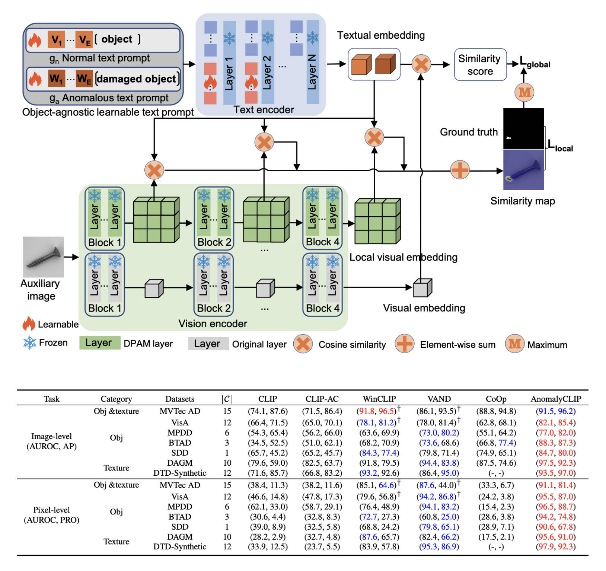
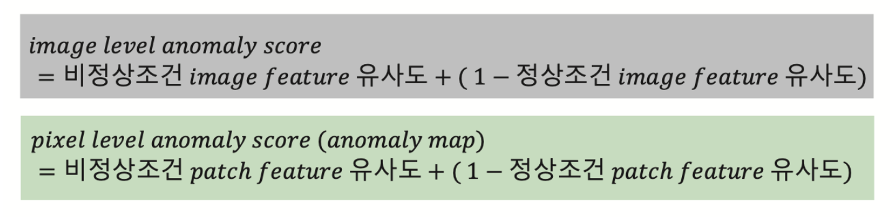
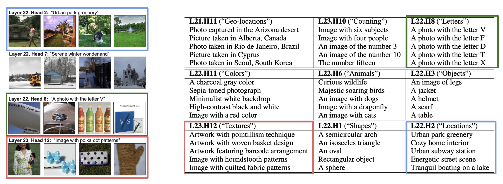
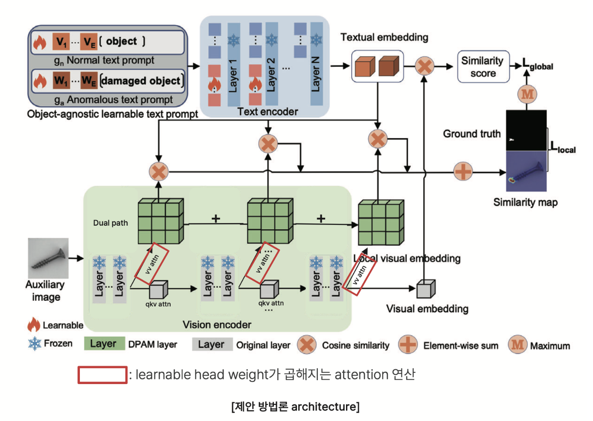
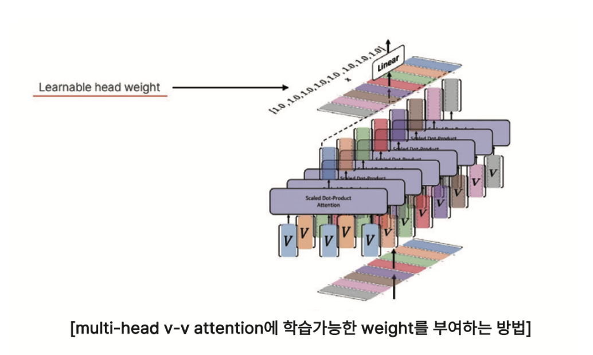
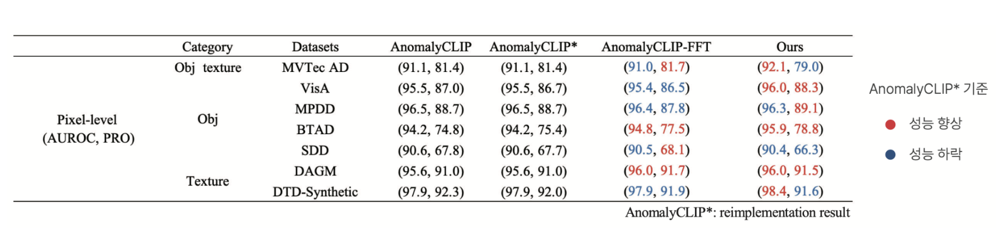
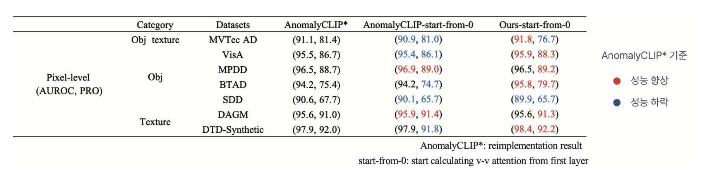

## 연구 배경

### AnomalyCLIP + Learnable Attention Head Weight

- Pixel-level AD 기준 정량적, 정성적인 차원에서 성능 개선을 위해 두 논문의 이론을 활용함

    - [*AnomalyCLIP : Object-agnostic Prompt Learning for Zero-shot Anomaly Detection. (ICLR 2024)*](https://arxiv.org/pdf/2310.18961)

    - [*Interpreting CLIP's Image Representation via Text-Based Decomposition (ICLR 2024)*](https://arxiv.org/pdf/2310.05916)

- 다양한 도메인에서 우수한 ZSAD(Zero-Shot Anomaly Detection) 성능을 보이는 AnomalyCLIP에 대한 연구와 ViT 내 attention head 마다 집중하는 이미지 요소가 다르다는 연구에서 얻은 아이디어를 기반으로 최종 patch representation 생성시 Industrial Anomaly Detection에 **악영향을 끼치는 요소에 집중하는 head의 기여도는 감소**하도록, **도움이 되는 요소에 집중하는 head의 기여도는 증가**하도록 만드는 연구

- 실험결과 pixel-level AD 기준 정량적, 정성적인 차원에서 성능 개선을 확인할 수 있었음

## 관련 연구

### AnomalyCLIP

- CLIP 모델구조를 활용하여 다양한 도메인에서 ZSAD를 수행할 수 있는 방법론

    - ZSAD : Zero-Shot Anomaly Detection

- Industrial AD dataset을 이용한 지도학습

- Text encoder 내 parameter 일부와 정상조건, 비정상 조건 learnable text prompt를 학습함

- Image encoder의 parameter는 freeze한 채, v-v attention 연산결과를 활용하여 patch feature를 생성함으로써 pixel-level AD성능을 개선함

- primary path의 결과인 Visual embedding는 image level AD에, dual path의 결과인 Local visual embedding는 pixel level AD에 사용됨


- 정상조건, 비정상조건 Textual embedding을 이용하여 image-level, pixel-level anomaly score를 계산할 수 있음

- 어텐션 연산이 전혀 이루어지지 않은 레이어의 연산결과를 사용하지 않기 위해 v-v attention은 4번째 레이어부터 시행하고 이를 누적합하여 사용함


### TEXTSPAN : Multi-head Self-Attention 내 각 attention head가 집중하는 이미지의 요소를 알아내는 방법

ImageNet 데이터셋 이미지 representation과 후보 텍스트 representation 사이의 유사도 분산을 이용하여 각 attention head가 집중하는 요소를 description의 형태로 밝혀냄


## 제안 방법론

### 아키텍처

각 attention head들이 서로 다른 이미지 요소에 집중하고 있으므로, AnomalyCLIP의 v-v attention의 ‘각 attention head’에 학습가능한 weight를 곱하는 방식을 통해, Industrial AD를 수행하는데 유리한 head와 불리한 head의 가중치가 학습과정 중에 업데이트 되도록 설계


### v-v attention head에 학습가능한 weight를 곱하는 방식

- Multi-head Self Attention에서 query와 key를 value로 치환한 방식이 v-v attention이기 때문에 v-v attention도 multi head attention이고 qkv attention과 동일하게 concat, projection의 과정을 거침

- concat된 multi head v-v attention 연산결과에 projection matrix를 곱하기 이전에 각 head별 학습가능한 weight를 곱함

    - 예시) len(attention head)=8, head\_weight = nn.Parameter(torch.ones(1,8))


## 실험 및 결과 분석

### 학습가능한 head weight가 v-v attention에 적용시 zero-shot AD 성능 향상 여부 실험

- 공통 세팅

    - 총 7개의 Industrial AD 데이터셋을 이용함

    - MVTec AD 데이터셋에 대해 학습 → ViSA, DTD, DAGM, SDD,MPDD, BTAD 데이터셋들에 대해 inference

    - ViSA 데이터셋에 대해 학습 → MVTec AD 데이터셋에 대해 inference

    - Epoch: 15, batch size: 8

    - 위의 실험 세팅은 AnomalyCLIP의 방식과 동일함

- 실험

    - 기존 AnomalyCLIP에 학습가능한 head weight만 적용한 경우

    - AnomalyCLIP의 v-v attention을 첫 번째 레이어에서부터 시행하며 학습가능한 head weight를 적용한 경우

- 추가 비교 대상(AnomalyCLIP-FFT)

    - image encoder 전체가 아니라 attention head 별 weight를 학습하는 것이 성능 향상의 원인임을 입증하기 위해, 기존 AnomalyCLIP의 image encoder를 unfreeze하고 학습시킨 경우의 성능을 report

### 실험 결과

- 제안방법론은 정량적인 지표(특히 AUROC) 상에서 기존 방법론에 비해 우월하였으며, 정성적으로도 anomaly map이 실제 이상 영역에 정상 영역과 확연하게 구분되는 anomaly score를 부여함을 보여주었음

- 이를 통해, 학습가능한 head weight 적용이 전체 patch representation(v-v attention 누적합)에서 industrial AD에 유리한 특징을 갖는 head의 결과물의 비중은 증가시키고, 불리한 특징을 갖는 head의 결과물의 비중은 감소시켰다고 유추할 수 있음

- 특히 image encoder를 unfreeze하여 학습했을 때 많은 경우에서 오히려 성능이 하락했는데, 이를 통해 학습가능한 head weight를 적용하는 것이 overfitting을 피하면서도 industrial AD에 도움이 되는 이미지적 특징을 학습하는 방법이라고 할 수 있음

### 기존 AnomalyCLIP과 동일하게 v-v attention을 네 번째 레이어에서부터 시행하고 학습가능한 head weight만 적용한 경우

- AnomalyCLIP-FFT의 경우 AUROC 기준 5개 데이터셋에서 성능 하락이, 2개의 데이터셋에서 성능 향상을 확인할 수 있었음

- 제안방법론은 AUROC 기준 7개 데이터셋 중 5개에서 성능 향상을 확인하였고, 두 개의 데이터셋에 대해서만 성능 하락이 발생하면서 head weight 적용이 이상 영역 탐지의 성능 향상에 도움이 됨을 확인하였음

- 다만 AUPRO은 두 경우 모두에서 4개 데이터셋에서는 성능 향상, 3개 데이터셋에서는 성능 하락이 확인되었음


### 기존 AnomalyCLIP과 달리 v-v attention을 첫 번째 레이어에서부터 시행하고 학습가능한 head weight를 적용한 경우

- 기존의 AnomalyCLIP은 attention 연산이 거의 시행되지 않은 초반 layer의 연산결과는 사용하지 않음

- AnomalyCLIP-start-from-0은 AnomalyCLIP에 비해 성능이 AUROC와 AUPRO에서 두 개의 데이터셋에서만 성능이 향상되었고, 나머지에 대해서는 주로 성능이 감소하였음

- 제안방법론은 AUROC 기준 7개 데이터셋 중 4개에서 성능 향상을, 하나의 데이터셋에 대해서만 성능 하락이 발생하였고, AUPRO에서는 5개의 데이터셋에서 성능 향상, 2개의 데이터셋에서 성능 하락을 확인함

- 학습가능한 head weight를 적용했을 때, AD에 유용한 v-v attention 연산결과를 훨씬 더 유연하고 동적으로 이용할 수 있음을 확인함


## 결론

### 연구요약

- AnomalyCLIP 모델의 ViT 내 v-v 어텐션 헤드에 학습가능한 head weight를 적용하여 제조업 도메인 이상 영역 탐지 성능을 개선할 수 있는 방법론 제안

- 실험결과, head weight를 적용하면 그렇지 않은 경우나 이미지 인코더를 unfreeze하여 미세조정한 경우에 비해 더 많은 데이터셋에서 이상 영역 탐지 성능 개선을 확인함(pixel auroc, pixel aupro)

- 정성적으로도 실험 결과, 실제 이상 영역에 더 집중하는 모습을 보였으며, 각 head 별 anomaly map과 학습된 head weight 사이 유의미한 관계를 확인함

### 한계

- 이상 영역 탐지(pixel-level AD)에 중점을 두고 있는 방법론이기 때문에 이상 탐지(image-level AD)는 고려하지 못함

### Comment

- 본 연구를 통해 수업에서 배운 CLIP에 대해 깊게 이해할 수 있었고 image representation은 MSA 연산결과와 MLP 연산결과의 합으로 표현될 수 있다는 점과, 두 요소 중 MSA가 압도적으로 중요하다는 것과 뒷 단의 4개의 레이어가 가장 많은 영향을 미친다는 것이 인상적이었음

- AnomalyCLIP와 같은 ZSAD(Zero-Shot Anomaly Detection)은 데이터 프라이버시에 민감해서 훈련 데이터에 접근할 수 없거나 훈련 데이터가 부족한 제조업 이상탐지에 최적인 방법이며 이러한 도메인 일반화 이상탐지는 최근 연구의 주된 흐름임을 인지함

- 이상 탐지 통합 프레임워크 ‘UniFormaly’와 ZSAD에 관심을 두고 추가적인 연구가 필요함


```toc
```