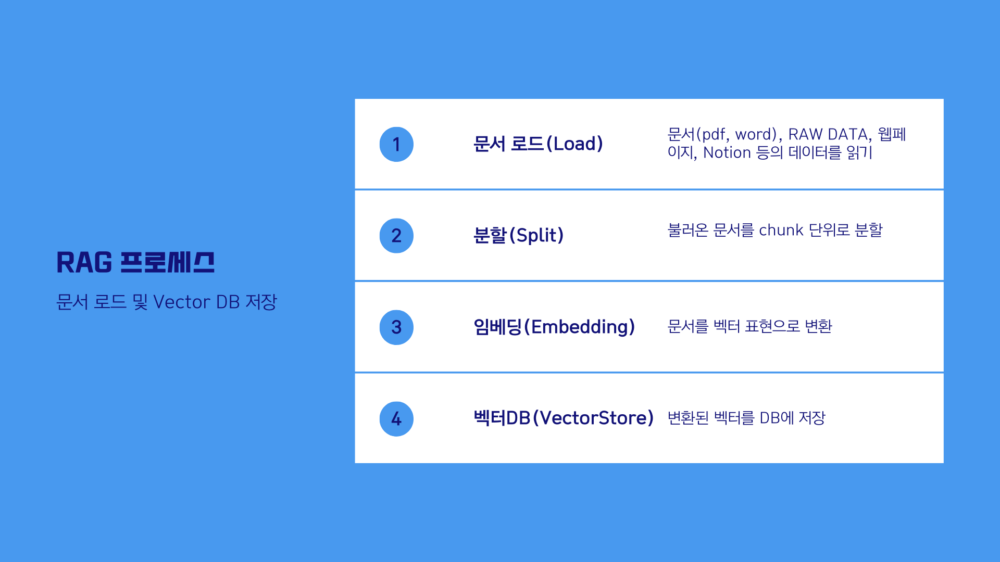
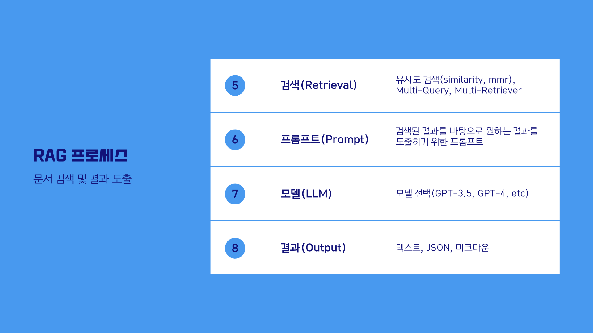
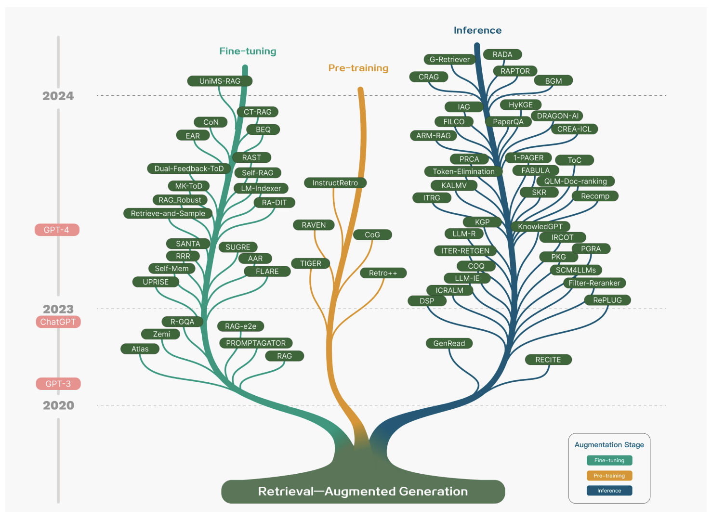
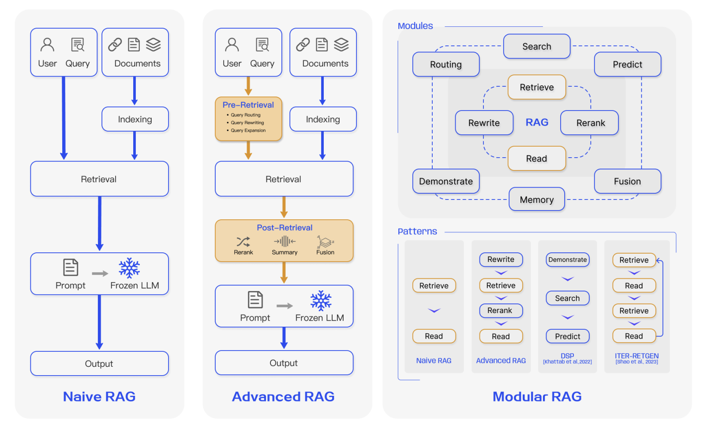
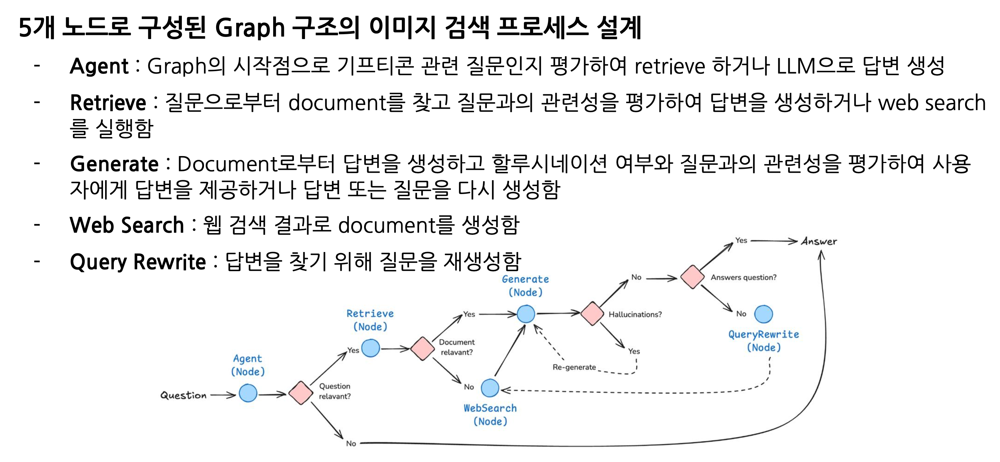
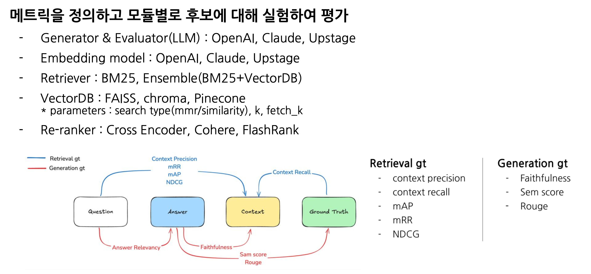
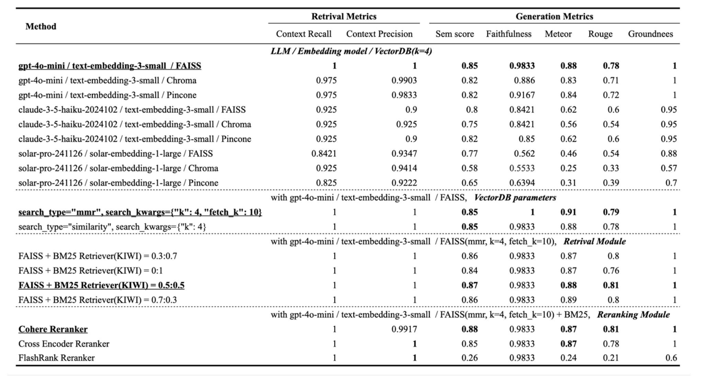
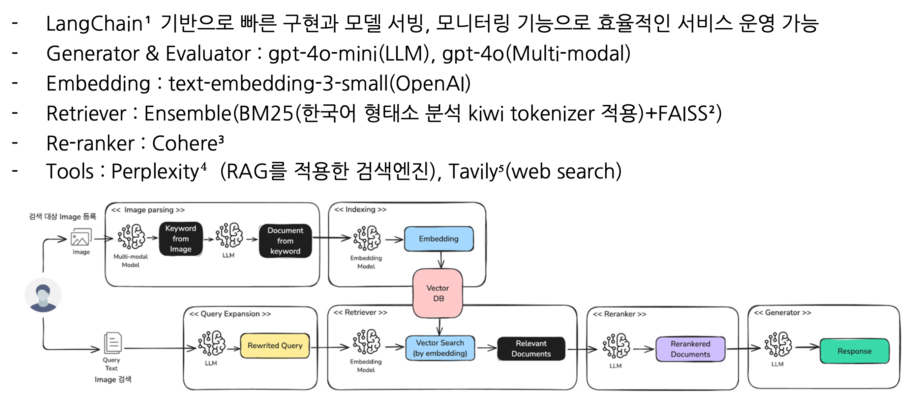

## RAG를 사용하는 이유와 기존 시스템의 한계

- RAG를 사용하는 주된 목적은 최신 정보를 포함한 답변을 제공하기 위함

    - GPT 같은 기존 모델은 사전 학습된 정보에만 의존하여, 할루시네이션 문제를 일으키거나 최신 정보를 반영하지 못할 수 있음

- RAG는 질문을 처리할 때, 외부의 최신 정보나 저장된 DB를 활용하여 더 정확한 답변을 가능하게함

    - 기존 시스템은 참고할 정보를 제공하지 않으므로, 정보가 오래되었거나 부족할 경우 부정확한 답변을 할 수밖에 없음

    - RAG를 통해 제공된 컨텍스트(문맥) 를 기반으로, 답변이 일반적인 수준에서 관련 정보를 찾아 참조된 정보로 변환함

    - 이를 통해 사용자는 최신 정보에 대한 정확한 응답을 받을 수 있으며, 기존 AI의 정보 부족 문제를 해결할 수 있음

## RAG 기본 구조

### 1. 사전작업(Pre-processing) - 1~4 단계

사전 작업 단계에서는 데이터 소스를 Vector DB (저장소) 에 문서를 `로드`-`분할`-`임베딩`-`저장` 하는 4단계를 진행합니다.

- 1단계 문서로드(Document Load) : 문서 내용을 불러옴

- 2단계 분할(Text Split) : 문서를 특정 기준(Chunk) 으로 분할

- 3단계 임베딩(Embedding) : 분할된(Chunk) 를 임베딩하여 저장

- 4단계 벡터DB 저장: 임베딩된 Chunk 를 DB에 저장

### 2. RAG 수행(RunTime) - 5~8 단계

- 5단계 검색기(Retriever)

    - 쿼리(Query) 를 바탕으로 DB에서 검색하여 결과를 가져오기 위하여 리트리버를 정의

    - 리트리버는 검색 알고리즘이며(Dense, Sparse) 리트리버로 나뉨

        - Dense : 유사도 기반 검색

        - Sparse : 키워드 기반 검색

- 6단계 프롬프트

    - RAG 를 수행하기 위한 프롬프트를 생성

    - 프롬프트의 context 에는 문서에서 검색된 내용이 입력

    - 프롬프트 엔지니어링을 통하여 답변의 형식을 지정할 수 있음

- 7단계 LLM : 모델 정의(GPT-3.5, GPT-4, Claude, etc..)

- 8단계 Chain : `프롬프트` - `LLM` - `출력` 에 이르는 체인을 생성합니다.

## RAG 주요 기능

- **인덱싱**

    - 소스에서 데이터를 수집하고 인덱싱하는 파이프

    - 이 작업은 보통 오프라인에서 발생

- **검색 및 생성**

    - 실제 RAG 체인으로, 사용자 쿼리를 실행 시간에 받아 인덱스에서 관련 데이터를 검색한 다음, 그 데이터를 모델에 전달

### 인덱싱

- **로드**

    - 먼저 데이터를 로드해야 함. 이를 위해 [DocumentLoaders](https://python.langchain.com/docs/modules/data_connection/document_loaders/)를 사용함

    - PDF 문서 등의 다양한 형태의 데이터를 로드하고 텍스트를 추출

- **분할**

    - [Text splitters](https://python.langchain.com/docs/modules/data_connection/document_transformers/)는 큰 `Documents`를 더 작은 청크로 나눔

    - 텍스트는 토큰 수를 기반으로 청크(chunk)로 분할되어 저장

    - 분할은 데이터를 인덱싱하고 모델에 전달하는 데 유용하며, 큰 청크는 검색하기 어렵고 모델의 유한한 컨텍스트 창에 맞지 않음

    - 텍스트 분할과 chunk overlap 을 통해 정보의 효율적 검색과 임베딩을 용이하게 함

- **임베딩**

    - 유사도를 계산하여 질문과 관련된 단락을 찾기 위해 분할된 청크를 임베딩함

    - 임베딩은 텍스트를 수학적 표현, 특히 벡터로 변환하여 계산할 수 있게 함

    - 하나의 단어, 문장 혹은 단락이 1,536개의 숫자로 표현되며, 이 숫자들은 유사도 계산에 활용

- **저장**

    - 나중에 검색할 수 있도록 분할을 저장하고 인덱싱할 장소가 필요함

    - [VectorStore](https://docs.langchain.com/oss/python/langchain/knowledge-base#3-vector-stores)와 [Embeddings](https://docs.langchain.com/oss/javascript/integrations/text_embedding/index#embedding-models) 모델을 사용하여 수행함

### 검색 및 생성

- **검색**

    - 사용자 입력이 주어지면 [Retriever](https://python.langchain.com/docs/modules/data_connection/retrievers/)를 사용하여 저장소에서 관련 분할을 검색

    - 쿼리와 단락 간의 유사도를 코사인 유사도 , 유클리디안 거리 등을 통해 측정하여 가장 가까운 단락을 선택

    - 적절한 단락 개수를 설정하는 것이 중요하며, 다양한 단락에서 정보를 수집하는 방식으로 효율성을 극대화함

- **생성**

    - [ChatModel](https://python.langchain.com/docs/modules/model_io/chat/) / [LLM](https://python.langchain.com/docs/modules/model_io/llms/)은 질문과 검색된 데이터를 포함한 프롬프트를 사용하여 답변 생성

## 텍스트 임베딩의 이해와 활용

- 유사도를 계산하여 질문과 관련된 단락을 찾기 위해 임베딩을 사용함

- 임베딩은 텍스트를 수학적 표현, 특히 벡터로 변환하여 계산할 수 있게 함

- 하나의 단어, 문장 혹은 단락이 1,536개의 숫자로 표현되며, 이 숫자들은 유사도 계산에 활용

- 쿼리와 단락 간의 유사도 를 코사인 유사도 , 유클리디안 거리 등을 통해 측정하여 가장 가까운 단락을 선택

- 텍스트 분할과 chunk overlap 을 통해 정보의 효율적 검색과 임베딩을 용이하게 함

### 유사도와 임베딩 개념의 이해

- 유사도는 주어진 질문과 여러 단락 중 얼마나 비슷한지를 수학적으로 계산하는 개념

- 문자를 수학적으로 계산하기 위해 단락을 수학적인 표현 으로 바꾸며, 이 과정을 임베딩 이라고 함

- 인베딩 은 텍스트를 좌표계처럼 수학적 표현으로 변환하는 것을 의미함

- 문서를 로드한 후 잘게 쪼갠 후, 각 단락을 수학적 표현으로 바꿔서 유사도 를 계산함

### 임베딩의 필요성과 활용

- 임베딩은 의미 이해와 정보 검색 의 향상을 위한 수단

[object Promise]### 임베딩과 벡터 변환의 역할

- 임베딩은 텍스트를 수학적 표현으로 바꾸는 과정으로, 숫자 벡터로 변환하여 보다 정교하게 표현

- OpenAI의 임베딩은 한 단락을 1,536개의 숫자로 표현하며, 이는 벡터 표현을 통한 유사도 계산을 가능하게 함

- 텍스트 스플리터(text splitter)를 사용해 문서를 청크 단위로 나누고, 필요한 정보를 효율적으로 분할하여 관리함

- 청크(chunk) 오버랩(overlap)을 적용해 중간에 잘리는 텍스트 없이 정보를 가져오며, 겹쳐서 나누어지는 이유는 연속성을 유지하기 위함

- 알고리즘에 따라 임베딩의 숫자 개수가 달라지며, 표현이 정교할수록 더 많은 리소스가 필요함

### 벡터와 유사도 계산을 활용한 정보 선택 과정

- 예를 들어, 시장 조사기관 IDC가 예측한 AI 소프트웨어 시장의 연평균 성장률을 벡터 표현으로 변환

- 1536개의 벡터로 표현한 후, 코사인 유사도 나 유클리디언 거리 등 다양한 알고리즘을 사용하여 거리 계산을 수행함

- 가장 가까운 벡터를 찾아 해당 단락을 선택하고, 이를 문맥의 입력으로 넣음

- 문맥의 입력은 특정 위치에 선택된 단락을 넣으며, 넣는 단락의 개수는 조정할 수 있음

## 문서 임베딩과 저장 과정의 중요성

- 임베딩을 수행한 후, 해당 데이터를 저장하는 것이 중요함

- 임베딩에는 비용이 발생하며, 이는 변환하는 데이터의 양에 비례함

- 같은 문서를 여러 번 임베딩하면 비효율적이므로, 변환된 데이터를 벡터 스토어 에 저장해서 활용함

- 저장된 벡터는 나중에 검색 및 유사도 계산을 통해 효율적으로 이용될 수 있음

- 이러한 과정은 RAG 프로세스의 사전 준비 단계로, 문서를 처리하고 유사도 계산을 위한 기초 작업임

## RAG 관련 연구

- [https://arxiv.org/pdf/2312.10997](https://arxiv.org/pdf/2312.10997)

- LLM의 한계를 극복하기 위해 지속적으로 개선되고 있음

    - Hallucination, 최신 정보 미반영, 도메인 지식 미반영, 지식의 불분명한 출처

- Naive RAG > Advanced RAG > Modular RAG¹ 으로 발전하고 있음

    - RAG의 한계를 넘어 다양한 방법으로 성능을 개선하고 진화해서 더 나은 검색과 생성 제공

    - 독립적인 기능 모듈로 유연성과 확장성, 유지 보수성 및 성능 향상

    - 조건부 흐름 제어와 동적 처리 가능으로 복잡한 비즈니스 로직 구현 가능

    - 참고 - Modular RAG : Transforming RAG Systems into LEGO-like Reconfigurable Frameworks(2024-07) - [https://arxiv.org/pdf/2407.21059v1](https://arxiv.org/pdf/2407.21059v1)

## RAG 어플리케이션 예시

### Modular RAG-based 이미지 검색기

#### 설계

- 참고

    - Self-RAG(2023-10) - [https://arxiv.org/abs/2310.11511](https://arxiv.org/abs/2310.11511)

    - LangGraph - [https://langchain-ai.github.io/langgraph/](https://langchain-ai.github.io/langgraph/)

#### 실험/평가

- RAGAS(2023-09) : [https://arxiv.org/pdf/2309.15217](https://arxiv.org/pdf/2309.15217)

- AutoRAG(2024-10) : [https://arxiv.org/abs/2410.20878](https://arxiv.org/abs/2410.20878)

#### 실험 결과

#### 구현

- 사용한 기술 스택

    1. LangChain framework - [https://python.langchain.com/docs/get\_started/introduction](https://python.langchain.com/docs/get_started/introduction)

    1. FAISS - [https://faiss.ai](https://faiss.ai/)

    1. Cohere - [https://docs.cohere.com/docs/overview](https://docs.cohere.com/docs/overview)

    1. Perplexity - [https://www.perplexity.ai](https://www.perplexity.ai/)

    1. Tavily - [https://tavily.com](https://tavily.com/)

## 실습

- [https://github.com/cserock/colab-examples/blob/main/07\_RAG\_pdf\_QA_%EC%98%88%EC%A0%9C.ipynb](https://github.com/cserock/colab-examples/blob/main/07_RAG_pdf_QA_%EC%98%88%EC%A0%9C.ipynb)

- [https://github.com/cserock/colab-examples/blob/main/07\_RAG\_web\_QA_%EC%98%88%EC%A0%9C.ipynb](https://github.com/cserock/colab-examples/blob/main/07_RAG_web_QA_%EC%98%88%EC%A0%9C.ipynb)

